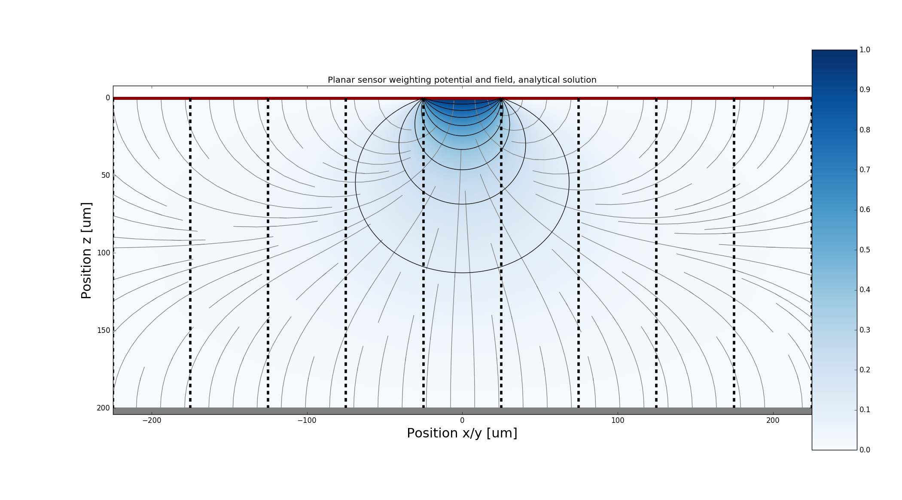
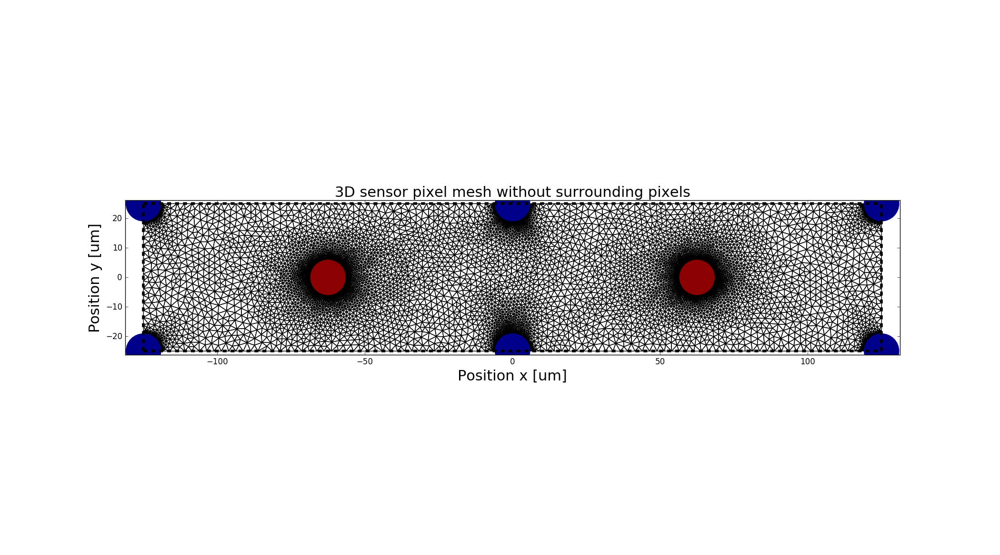

.. toctree::
   :numbered:

Examples
********

Weighting field of planar sensor
=========================================
.. automodule:: scarce.examples.planar_sensor
.. image:: _static/Example_planar_numeric.png

The mesh size determines the quality of the numerical result and can be changed in the example.

Weighting field of 3D sensor
=========================================
.. automodule:: scarce.examples.3D_sensor

The mesh size determines the quality of the numerical result and can be changed in the example.

Silicon propteries
=========================================
.. automodule:: scarce.examples.plot_properties

These plots are shown in :ref:`silicon-label`.

