.. toctree::
   :numbered:

Examples
********

Weighting field of a planar sensor
=========================================
.. automodule:: scarce.examples.sensor_planar_weighting
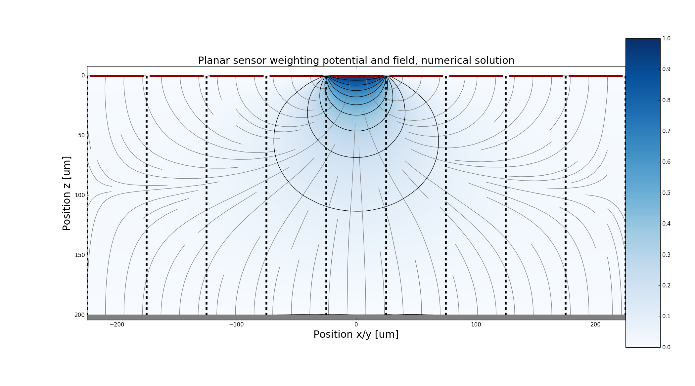

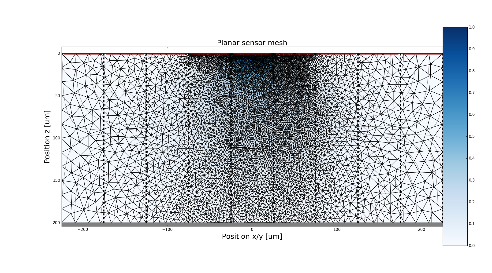

The mesh size determines the quality of the numerical result and can be changed in the example.

Potential of a planar silicon sensor
=========================================
.. automodule:: scarce.examples.sensor_planar
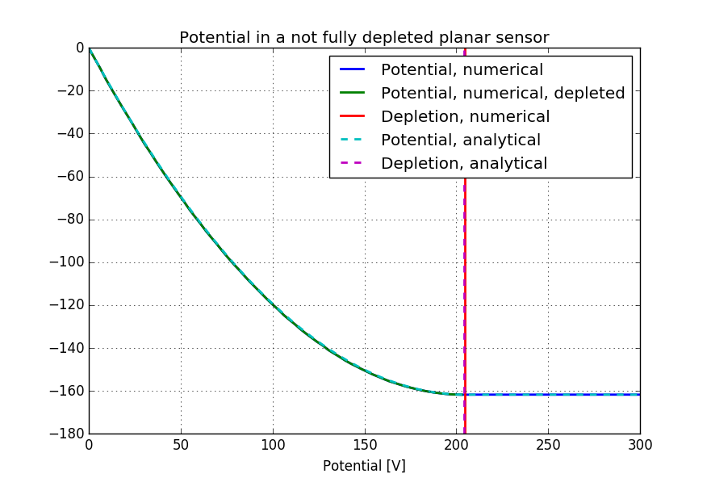

Weighting field of a 3D sensor
=========================================
.. automodule:: scarce.examples.sensor_3D_weighting
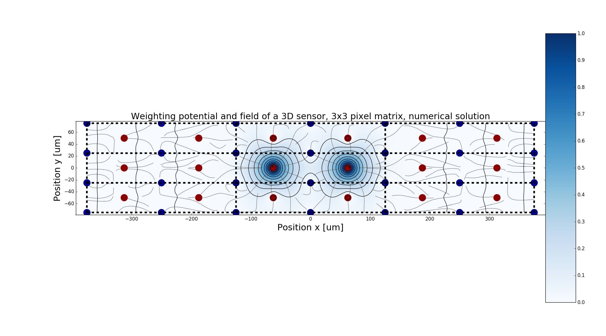
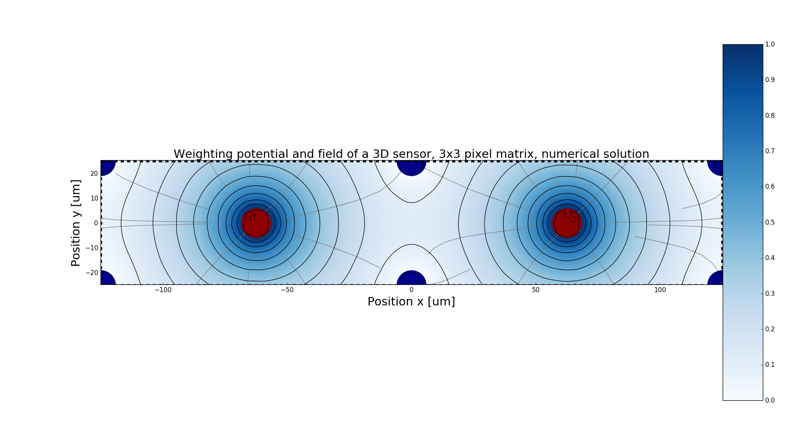
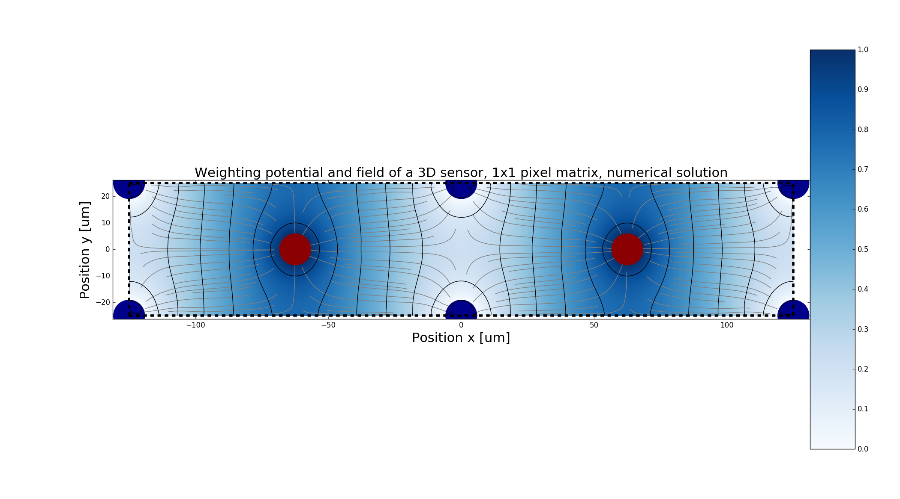
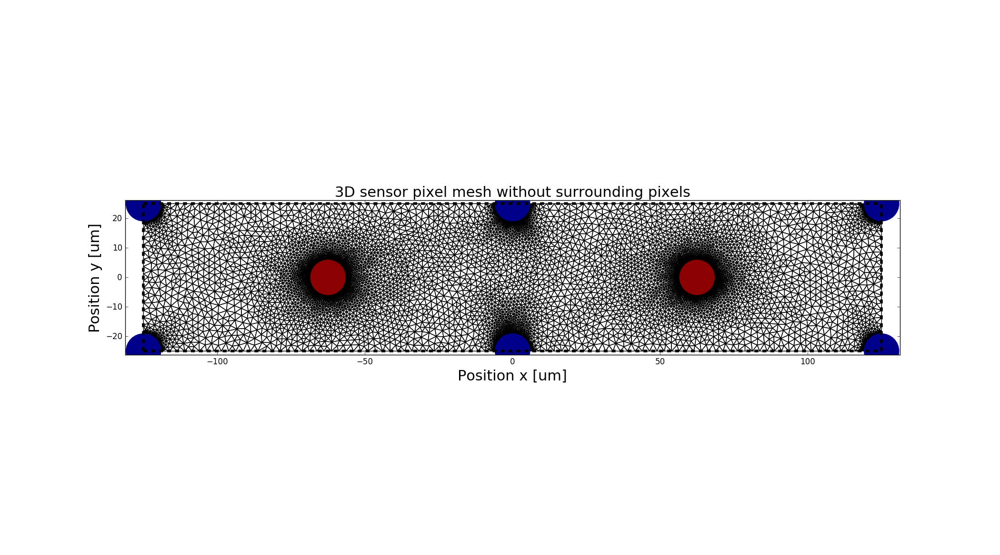

The mesh size determines the quality of the numerical result and can be changed in the example.

Potential of a 3D sensor
=========================================
.. automodule:: scarce.examples.sensor_3D
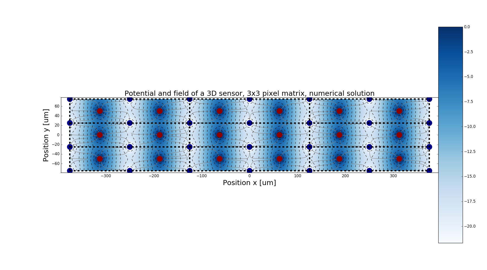
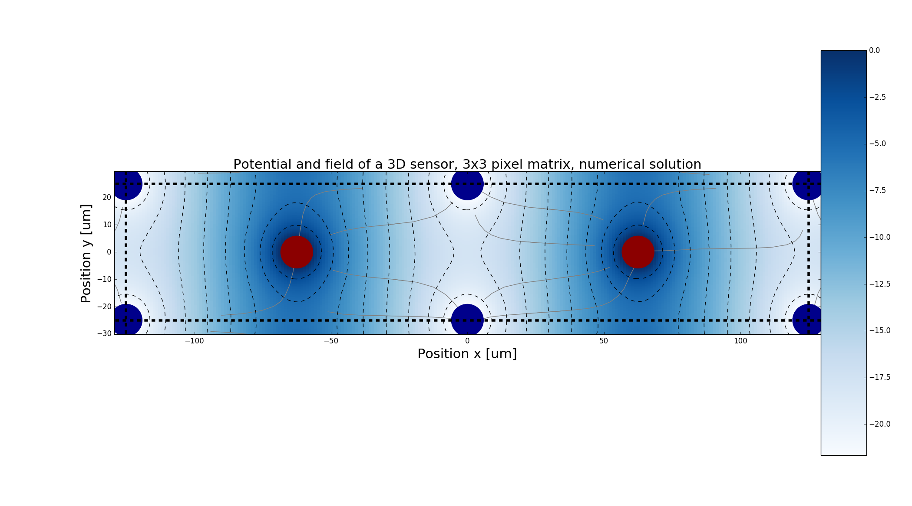
.. image:: _static/Example_3D_numeric_1_1.png

1D potential in a planar silicon sensor
=========================================
.. automodule:: scarce.examples.potential_1D
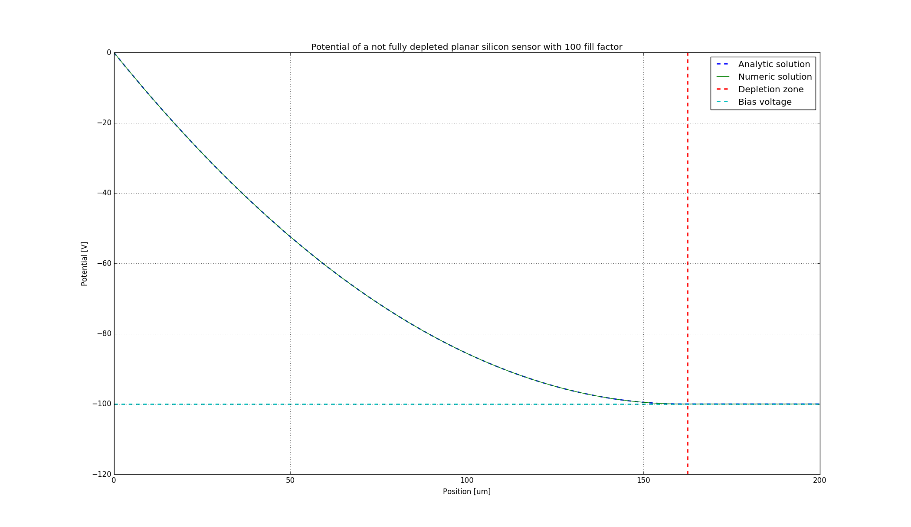
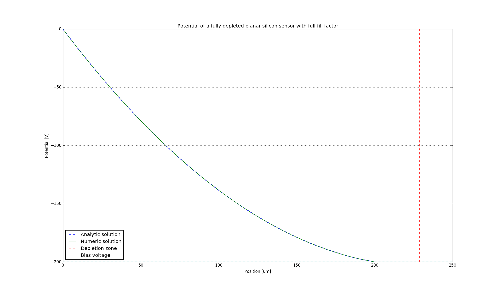

Drifting e-h pairs in planar sensor
=========================================
.. automodule:: scarce.examples.transient_planar
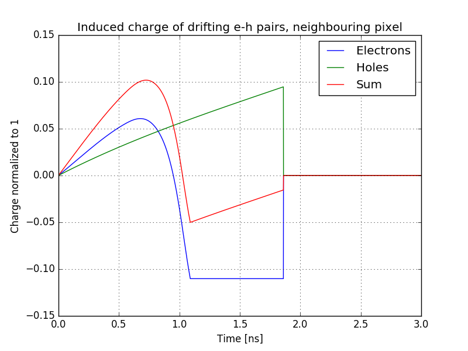
.. image:: _static/Example_transient_planar_readout.png
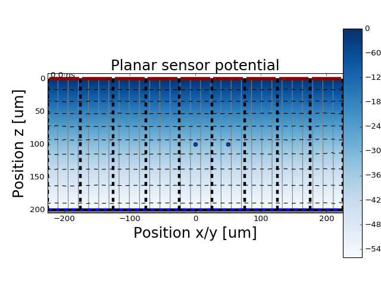

Drifting e-h pairs in 3D sensor
=========================================
.. automodule:: scarce.examples.transient_3D

The following shows the induced charge for e-h pairs at
different start positions with and without diffusion.

With diffusion:

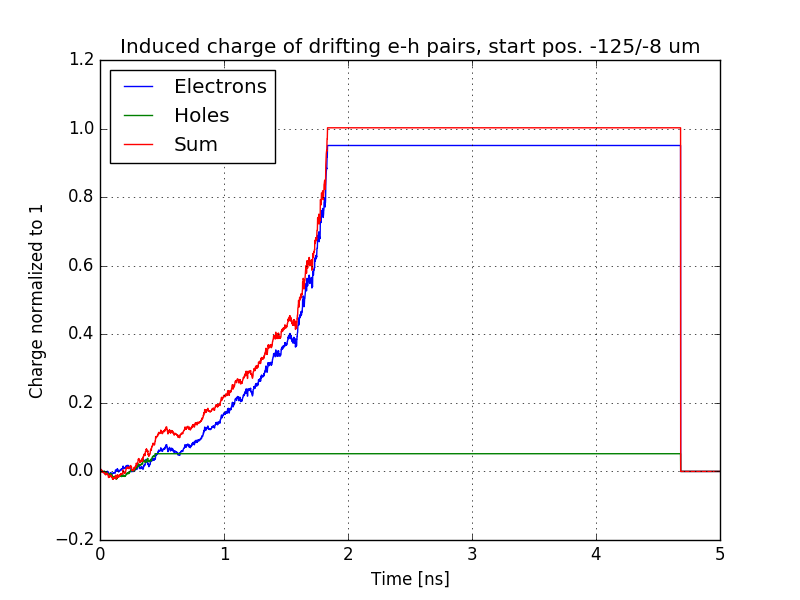

Without diffusion:

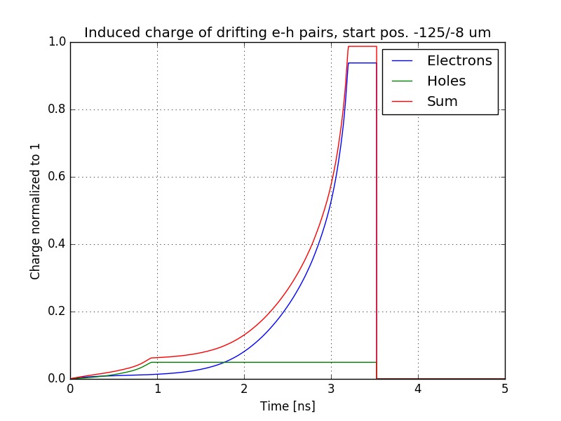

With diffusion:

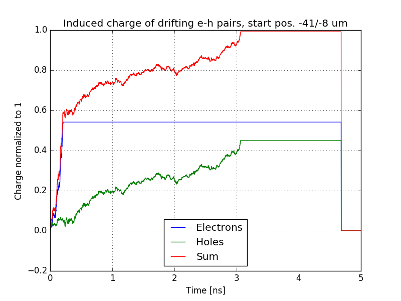

Without diffusion:

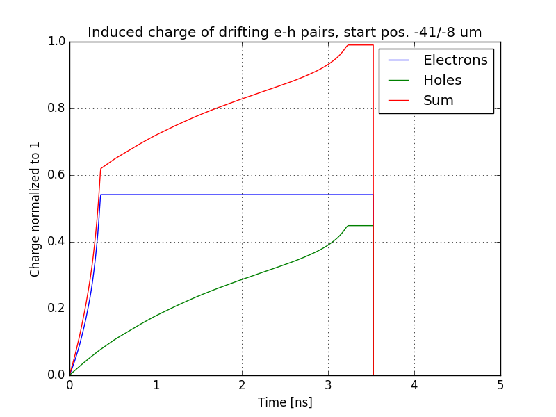

.. image:: _static/Example_3D_drift.gif

Silicon properties
=========================================
.. automodule:: scarce.examples.plot_properties

These plots are shown in :ref:`silicon-label`.

