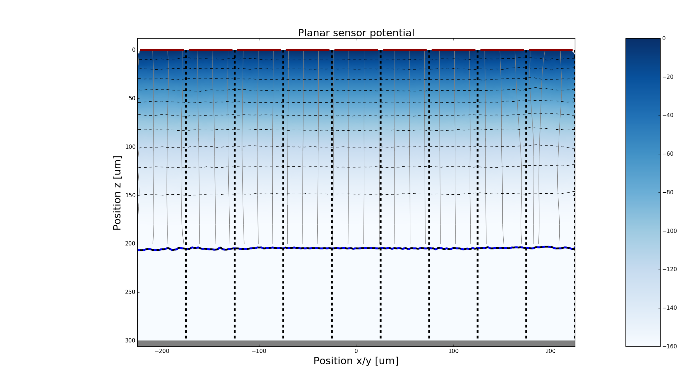

.. toctree::
   :numbered:

Examples
********

Weighting field of planar sensor
=========================================
.. automodule:: scarce.examples.sensor_planar_weighting

.. image:: _static/Example_planar_analytic.png

The mesh size determines the quality of the numerical result and can be changed in the example.

Weighting field of 3D sensor
=========================================
.. automodule:: scarce.examples.sensor_3D_weighting
.. image:: _static/Example_3D_numeric_3_3.png
.. image:: _static/Example_3D_numeric_3_3_zoom.png
.. image:: _static/Example_3D_numeric_1_1.png
.. image:: _static/Example_3D_mesh.png

The mesh size determines the quality of the numerical result and can be changed in the example.

1D potential in a planar silicon sensor
=========================================
.. automodule:: scarce.examples.potential_1D
.. image:: _static/Example_1D_potential_partially_depleted.png

Silicon properties
=========================================
.. automodule:: scarce.examples.plot_properties

These plots are shown in :ref:`silicon-label`.

