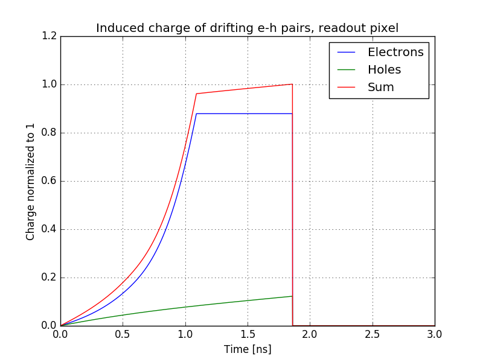

.. toctree::
   :numbered:

Examples
********

Weighting field of a planar sensor
=========================================
.. automodule:: scarce.examples.sensor_planar_weighting

.. image:: _static/Example_planar_mesh_w.png

The mesh size determines the quality of the numerical result and can be changed in the example.

Potential of a planar silicon sensor
=========================================
.. automodule:: scarce.examples.sensor_planar

.. image:: _static/Example_planar_numeric.png

Weighting field of a 3D sensor
=========================================
.. automodule:: scarce.examples.sensor_3D_weighting
.. image:: _static/Example_3D_w_numeric_3_3.png

The mesh size determines the quality of the numerical result and can be changed in the example.

Potential of a 3D sensor
=========================================
.. automodule:: scarce.examples.sensor_3D

1D potential in a planar silicon sensor
=========================================
.. automodule:: scarce.examples.potential_1D

.. image:: _static/Example_1D_potential_fully_depleted.png

Drifting e-h pairs in planar sensor
=========================================
.. automodule:: scarce.examples.transient_planar

Drifting e-h pairs in 3D sensor
=========================================
.. automodule:: scarce.examples.transient_3D

The following shows the induced charge for e-h pairs at
different start positions with and without diffusion.

With diffusion:

Without diffusion:

With diffusion:

Without diffusion:

.. image:: _static/Example_transient_3D_m41_m8.png

.. image:: _static/Example_3D_drift.gif

Silicon properties
=========================================
.. automodule:: scarce.examples.plot_properties

These plots are shown in :ref:`silicon-label`.

